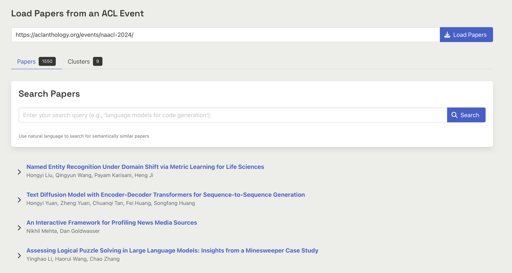
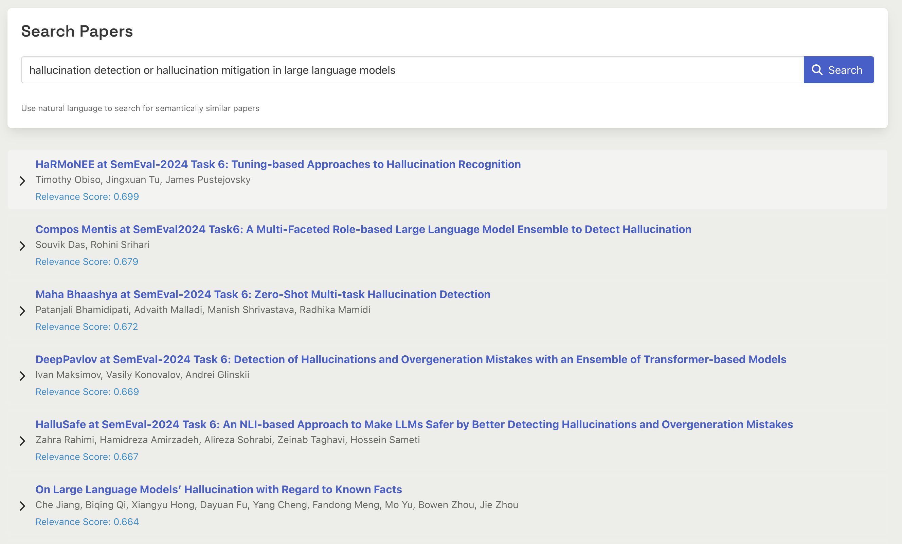
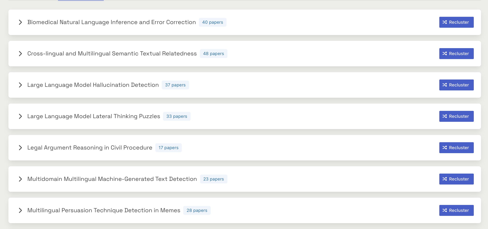
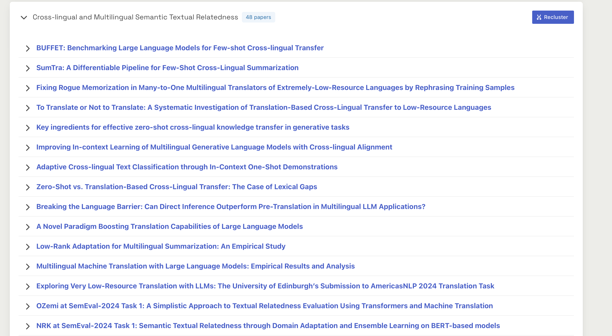

# ACL Event Search

A simple web application that provides semantic search and clustering capabilities for academic papers from specific ACL Anthology events. Simply paste the URL of an ACL Anthology event into the input field and click "Load Papers". The tool first fetches the papers, indexes them for semantic search, and then clusters them using HDBSCAN and Gemini. The clusters can then be explored and refined if needed. 

## Features

- Load papers from any ACL Anthology event URL (e.g., EMNLP, ACL, NAACL)

- Semantic search through paper abstracts using natural language queries

- Interactive clustering of papers based on their content



## Installation

1. Clone the repository:
```bash
git clone https://github.com/shahbazsyed/acl-event-search.git
cd acl-event-search
```

2. Create a virtual environment and activate it:
```bash
python -m venv venv
source venv/bin/activate 
```

3. Install the required dependencies:
```bash
pip install -r requirements.txt
```

## Usage

1. Start the FastAPI server:
```bash
uvicorn main:app --reload
```

2. Open your browser and navigate to `http://localhost:8000`

3. Use the application:
   - **Step 1**: Enter an ACL Anthology event URL (e.g., https://aclanthology.org/events/emnlp-2023/)
   - **Step 2**: After papers are loaded, you can:
     - Click "View All Papers" to see all papers from the event
     - Use the search box to find specific papers using natural language queries

## Example Queries

Here are some example search queries you can try:
- "language models for reasoning tasks"
- "efficient transformer architectures"
- "multilingual machine translation"
- "prompt engineering techniques"

## Project Structure

```
acl-event-search/
├── main.py              # FastAPI application
├── gemini_utils.py      # Gemini utilities for cluster labeling
├── paper_utils.py       # Paper processing utilities
├── requirements.txt     # Python dependencies
├── static/
│   ├── index.html      # Frontend HTML
│   ├── app.js          # Frontend JavaScript
│   └── style.css       # Custom styles
└── cache/              # Paper cache directory (created automatically)
```
